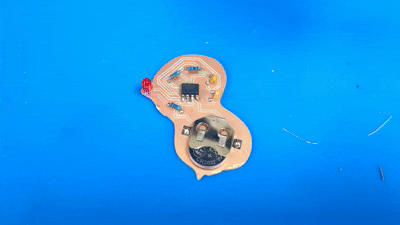
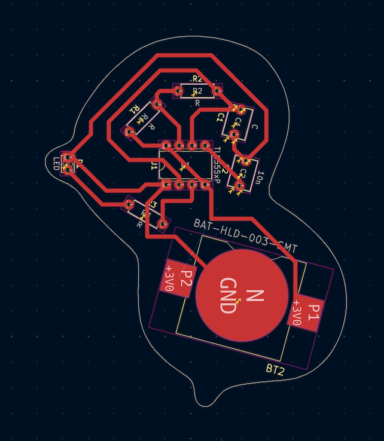

# 🦆 The Duck 555 Timer Pendant

**A custom PCB pendant featuring a flashing LED integrated into a stylized duck form factor.**

Blog: https://www.notion.so/PCB-Design-and-Fabrication-3053158f0df780498474fec68f859eae?source=copy_link

## Project Overview
This project explores PCB fabrication as an artistic medium. The circuit is a standard astable multivibrator using a **TL555 timer chip**, designed to flash a red LED located at the duck's mouth/bill. The board is powered by a 3.7V coin cell battery.

The physical outline of the board is milled to resemble the side profile of a duck, experimenting with the idea of "playfulness" in hardware.

## Technical Specifications
* **Chip:** TL555 (Low power CMOS 555 timer)
* **Power Source:** 3V - 3.7V Coin Cell (CR2032 or similar)
* **Visual Output:** 1x Red LED (5mm)
* **Fabrication:** CNC Milled Copper Clad Board

## Bill of Materials (BOM)

| Component | Value/Type | Qty | Notes |
| :--- | :--- | :--- | :--- |
| U1 | TL555 | 1 | 8-pin DIP or SOIC |
| LED1 | Red LED | 1 | Placed at mouth coordinates |
| R1, R2 | 1kΩ - 100kΩ | 2 | Adjust for flash rate |
| C1 | 10µF | 1 | Electrolytic or Ceramic |
| Battery Holder | CR2032 SMT | 1 | Rear mount |

 

## 🛠️ Reproduction Steps

This section details the process for replicating the Duck Pendant, from digital design to physical assembly.

### 1. Circuit Design & Layout (KiCad)
The circuit is based on a standard astable multivibrator configuration using a TL555 timer.

1.  **Schematic:** Create the schematic in KiCad using the BOM listed above. Connect the output (Pin 3) to the LED current limiting resistor.
2.  **Board Outline:** I designed the outline in Adobe Illustrator to get the curves right, then imported the SVG into the `Edge.Cuts` layer in KiCad.
3.  **Placement:** Place the LED at the coordinate corresponding to the duck's mouth. The battery holder goes on the back (`B.Cu`) to keep the front clean.
4.  **Routing:** Route traces on the front (`F.Cu`) and back (`B.Cu`). Keep traces > 0.3mm for reliable CNC milling.

*(Above: The PCB layout in KiCad showing the placement of the LED relative to the board outline)*

### 2. File Preparation
To prepare the files for the Carvey CNC:
1.  **Export:** Generate Gerber files and Drill files from KiCad.
2.  **Convert:** Use the `pcb_to_easel.sh` script to convert the Gerbers into SVG format.

### 3. Fabrication (CNC Milling)
1.  **Setup:** Secure a copper blank to the Carvey bed.
2.  **Easel Settings:**
    * **Traces:** Cut depth approx 0.11mm - 0.15mm.

### 4. Assembly
Solder the 555timer last. 

---

## 📝 What I Learned / Improvements
The fabrication process taught me a lot, specifically about where *not* to put things.

**The "Tab" Improvement:**
When I set up the milling file, I placed one of the "attach points" (the tabs that hold the board down inside the CNC machine) right near the mouth/beak area. Because the beak has small, detailed curves, sanding off the leftover tab material without ruining the shape was actually really difficult. Next time, I would place those tabs somewhere flat where I can easily file it down without stressing about the details.

---
*Created for Creative Embedded System - Spring 2026*